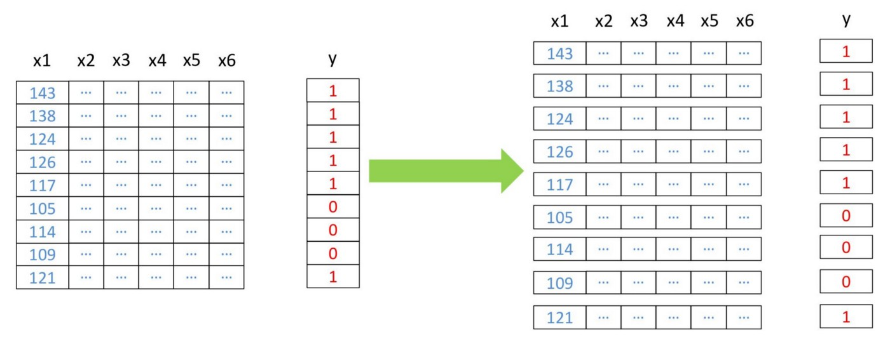
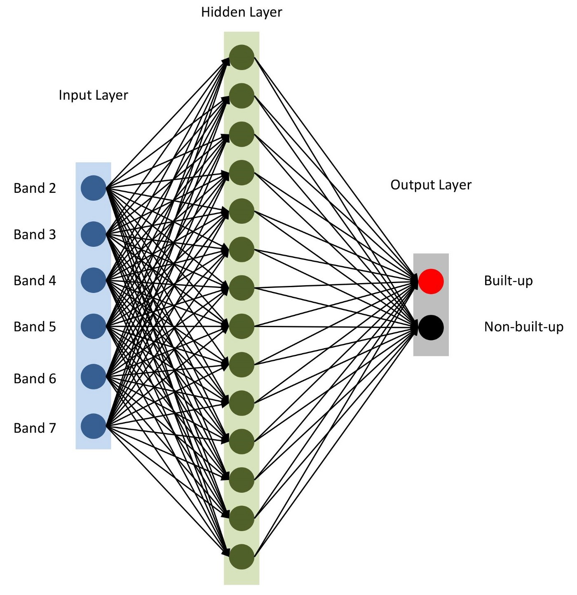

# Landsat-Classification-Using-Neural-Network

# Data used in the current scope

working with six bands (band 2 — band 7) of Landsat 5 TM as features and try to predict the binary built-up class. A multispectral Landsat 5 data acquired in the year 2011 for Bangalore and its corresponding binary built-up layer will be used for training and testing. Finally, another multispectral Landsat 5 data acquired in the year 2011 for Hyderabad will be used for new predictions.

##  This is a supervised ML approach (using labelled data to train the model)

**Multispectral training data and its corresponding binary built-up layer

The used libraries: 
- pyrsgis — to read and write GeoTIFF
- scikit-learn — for data pre-processing and accuracy checks
- numpy — for basic array operations
- Tensorflow — to build the neural network model

**We will now change the shape of the arrays to a two-dimensional array, which is expected by the majority of ML algorithms, where each row represents a pixel. The convert module of the pyrsgis package will do that for us.


Schemata of restructuring of data

## Data Training and Validation
Now, we will split the data for training and validation. This is done to make sure that the model has not seen the test data and it performs equally well on new data. Otherwise, the model will overfit and perform well only on training data.

```
from sklearn.model_selection import train_test_split
xTrain, xTest, yTrain, yTest = train_test_split(featuresBangalore, labelBangalore, test_size=0.4, random_state=42)
print(xTrain.shape)
print(yTrain.shape)
print(xTest.shape)
print(yTest.shape)
```
Output: 
```
(2519025, 6)
(2519025,)
(1679351, 6)
(1679351,)
```

**The test_size (0.4) in the code snippet above signifies that the training-testing proportion is 60/40.

Many ML algorithms including NNs expect normalised data. This means that the histogram is stretched and scaled between a certain range (here, 0 to 1). We will normalise our features to suffice this requirement. Normalisation can be achieved by subtracting the minimum value and dividing by range. Since the Landsat data is an 8-bit data, the minimum and maximum values are 0 and 255 (2⁸ = 256 values).

***Reshape from 2D to 3D 

Another additional pre-processing step is to reshape the features from two-dimensions to three-dimensions, such that each row represents an individual pixel.


```
# Normalise the data
xTrain = xTrain / 255.0
xTest = xTest / 255.0
featuresHyderabad = featuresHyderabad / 255.0
# Reshape the data
xTrain = xTrain.reshape((xTrain.shape[0], 1, xTrain.shape[1]))
xTest = xTest.reshape((xTest.shape[0], 1, xTest.shape[1]))
featuresHyderabad = featuresHyderabad.reshape((featuresHyderabad.shape[0], 1, featuresHyderabad.shape[1]))
# Print the shape of reshaped data
print(xTrain.shape, xTest.shape, featuresHyderabad.shape)
```
Output: 
```
(2519025, 1, 6) (1679351, 1, 6) (1391808, 1, 6)
```
# Building the Model using Keras
**NOTES Bout the model:**

- Use the sequential model, to add the layers one after the other. 
- One input layer (number of nodes equal to nBands)
- One hidden layer with 14 nodes and ‘relu’ as the activation function is used. 
- compile the model with ‘adam’ optimiser

```
from tensorflow import keras

# Define the parameters of the model
model = keras.Sequential([
    keras.layers.Flatten(input_shape=(1, nBands)),
    keras.layers.Dense(14, activation='relu'),
    keras.layers.Dense(2, activation='softmax')])

# Define the accuracy metrics and parameters
model.compile(optimizer="adam", loss="sparse_categorical_crossentropy", metrics=["accuracy"])

# Run the model
model.fit(xTrain, yTrain, epochs=2)
-The final layer contains two nodes for the binary built-up class with ‘softmax’ activation function, which is suitable for categorical output. 

```

