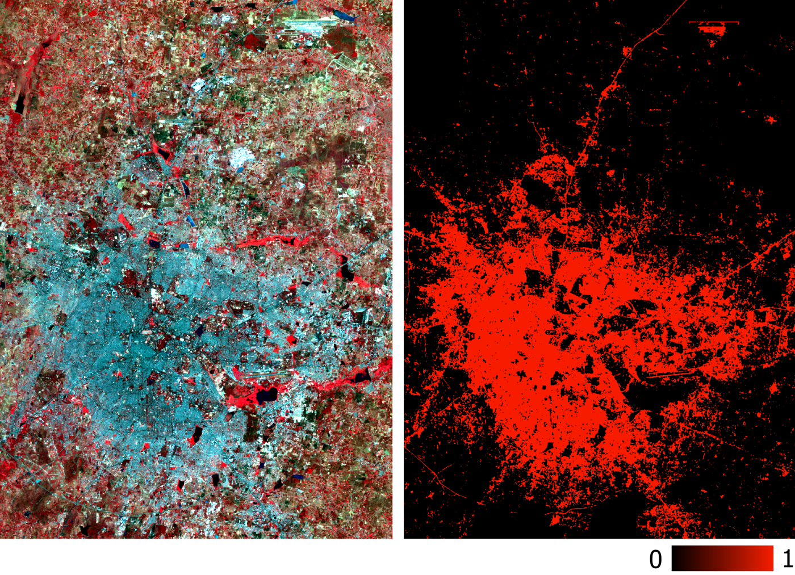

# Landsat-Classification-Using-Neural-Network

# Data used in the current scope

working with six bands (band 2 — band 7) of Landsat 5 TM as features and try to predict the binary built-up class. A multispectral Landsat 5 data acquired in the year 2011 for Bangalore and its corresponding binary built-up layer will be used for training and testing. Finally, another multispectral Landsat 5 data acquired in the year 2011 for Hyderabad will be used for new predictions.

##  This is a supervised ML approach (using labelled data to train the model)

Multispectral training data and its corresponding binary built-up layer
