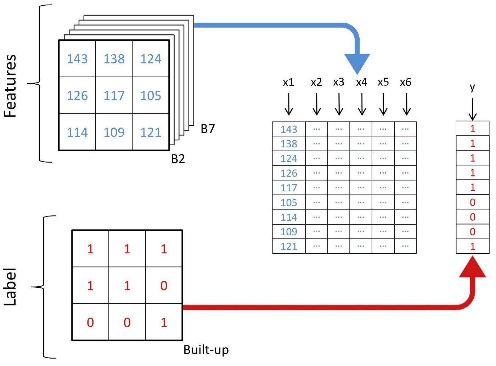

# Landsat-Classification-Using-Neural-Network

# Data used in the current scope

working with six bands (band 2 — band 7) of Landsat 5 TM as features and try to predict the binary built-up class. A multispectral Landsat 5 data acquired in the year 2011 for Bangalore and its corresponding binary built-up layer will be used for training and testing. Finally, another multispectral Landsat 5 data acquired in the year 2011 for Hyderabad will be used for new predictions.

##  This is a supervised ML approach (using labelled data to train the model)

**Multispectral training data and its corresponding binary built-up layer

The used libraries: 
- pyrsgis — to read and write GeoTIFF
- scikit-learn — for data pre-processing and accuracy checks
- numpy — for basic array operations
- Tensorflow — to build the neural network model

**We will now change the shape of the arrays to a two-dimensional array, which is expected by the majority of ML algorithms, where each row represents a pixel. The convert module of the pyrsgis package will do that for us.

Schemata of restructuring of data

## Data Training and Validation
Now, we will split the data for training and validation. This is done to make sure that the model has not seen the test data and it performs equally well on new data. Otherwise, the model will overfit and perform well only on training data.

`from sklearn.model_selection import train_test_split

xTrain, xTest, yTrain, yTest = train_test_split(featuresBangalore, labelBangalore, test_size=0.4, random_state=42)

print(xTrain.shape)
print(yTrain.shape)

print(xTest.shape)
print(yTest.shape)`

Output: 

`(2519025, 6)
(2519025,)
(1679351, 6)
(1679351,)
`
